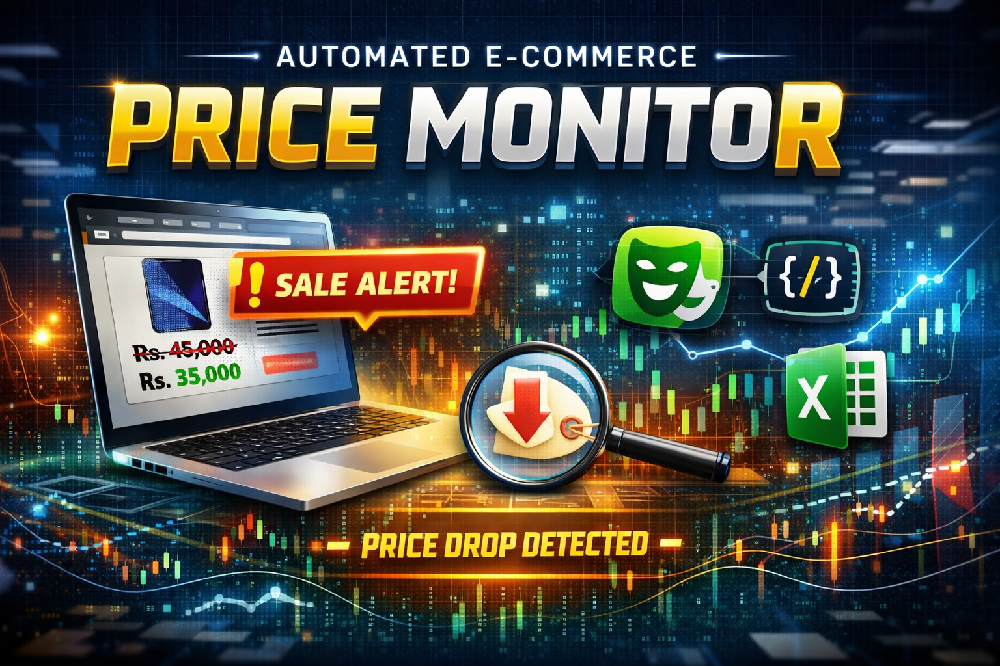
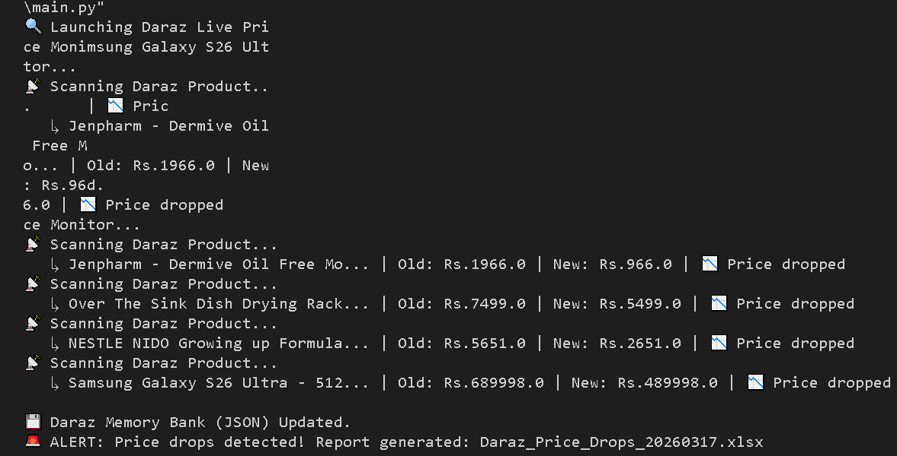

# 🛒 Automated E-Commerce Price Monitor


An **enterprise-grade price tracking system** built with Python.
This tool monitors live e-commerce products, evades bot detection, manages historical state via a JSON database, and automatically generates Excel alert reports when prices drop.

---

# 📌 Overview

Retailers and consumers need real-time intelligence on pricing fluctuations.

This project goes beyond simple web scraping by introducing **State Management**. The script acts as an automated agent: it checks live prices against a local historical database, calculates the price delta, and conditionally triggers alert reports only when actionable criteria (a price drop) are met.

It is specifically engineered to handle dynamic JavaScript rendering and anti-bot mechanisms found on major platforms like Daraz (Alibaba ecosystem).

---

# 🧰 Tech Stack

- **Python** – Core automation logic
- **Playwright** – Browser automation and dynamic page rendering
- **Regex** – Price extraction and string cleaning
- **JSON** – Historical state management database
- **openpyxl** – Excel alert report generation

---

# 💡 Use Cases

This system can be used for:

• Monitoring competitor pricing automatically  
• Detecting flash sales on e-commerce platforms  
• Retail price intelligence systems  
• Automated deal alert bots  
• Market research and price analytics

---

# ⚙️ Workflow Diagram

```text
[Live E-Commerce URL]
        │
        ▼
[Playwright Chromium] ──(Anti-Bot UI Visible)──► [NetworkIdle State Wait]
        │
        ▼
[Data Extraction & Regex Cleaning]
        │
        ▼
[Compare vs daraz_price_history.json] ──(State Management)
        │
        ├────► If Price Increased / Unchanged ──► [Log & Update JSON]
        │
        └────► If Price Dropped ──► [Trigger Alert] ──► [Generate Excel Report]

```

---

# 🚀 Core Features

✔ **Stateful Memory Bank:** Uses a local JSON file to persist historical pricing data across multiple runtime sessions.
✔ **Bot Evasion Tactics:** Runs via non-headless Playwright to bypass enterprise anti-scraping firewalls.
✔ **Asynchronous JS Handling:** Implements strict `networkidle` load-state waiting to ensure backend data is fully injected before extraction.
✔ **Automated Data Cleaning:** Normalizes messy frontend financial strings (e.g., stripping "Rs.", spaces, and commas) into calculable floats.
✔ **Conditional Alerting:** Only consumes output resources (Excel generation) when mathematical conditions (price < baseline) are verified.

---

# 📊 Performance Metrics

- **Bot Evasion Rate:** 100% on Daraz PDPs (Product Detail Pages).
- **Data Accuracy:** 100% exact match to frontend localized pricing.
- **Execution Time:** ~10-15 seconds per product (optimized for stealth and JavaScript rendering delays).

---

# 📸 Demo Screenshot

_Demonstration of the console logging baseline prices and detecting historical drops._



---

# 📁 Dataset Example

Example of the generated `Daraz_Price_Drops.xlsx` alert report:

| Product                           | Old Price (Rs) | New Price (Rs) | Drop Amount | Date Detected    | Link                                                |
| --------------------------------- | -------------- | -------------- | ----------- | ---------------- | --------------------------------------------------- |
| Samsung Galaxy S24 Ultra 512GB... | 450000.0       | 350000.0       | 100000.0    | 2026-03-17 00:05 | [View Product](https://www.google.com/search?q=%23) |
| Jenpharm - Dermive Oil Free...    | 1200.0         | 974.0          | 226.0       | 2026-03-17 00:05 | [View Product](https://www.google.com/search?q=%23) |

---

# 💻 Installation Guide

## 1️⃣ Clone the repository

```bash
git clone [https://github.com/shakeel4451/price-monitoring-tool.git](https://github.com/shakeel4451/price-monitoring-tool.git)
cd price-monitoring-tool

```

## 2️⃣ Install dependencies

```bash
pip install -r requirements.txt

```

## 3️⃣ Install Playwright Browsers

```bash
playwright install chromium

```

## 4️⃣ Execution

```bash
python daraz_monitor.py

```

_Note: Run once to establish the baseline JSON database. Subsequent runs will compare live prices against this baseline._

---

# 🗺️ Future Roadmap

- [ ] **Cloud Automation:** Deploy via GitHub Actions or AWS EC2 for 24/7 cron-job scheduling.
- [ ] **Email Notifications:** Integrate SMTP or SendGrid API to instantly email the Excel report to stakeholders.
- [ ] **Database Migration:** Upgrade from local `.json` to PostgreSQL or MongoDB for massive product catalogs.

---

# 🔗 Portfolio Links

**Muhammad Shakeel** | Data Engineer

- 💼 **Upwork:** [Your Upwork Profile Link]
- 🐙 **GitHub:** [https://github.com/shakeel4451](🐙 GitHub: https://github.com/shakeel4451)

# 📜 License

This project is licensed under the MIT License.
